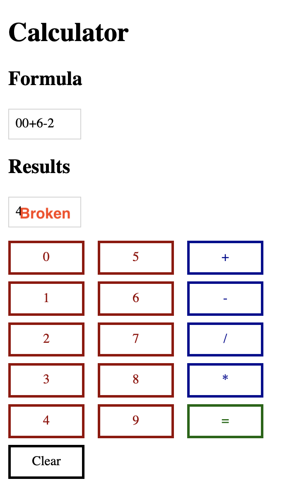
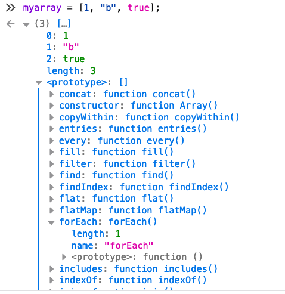
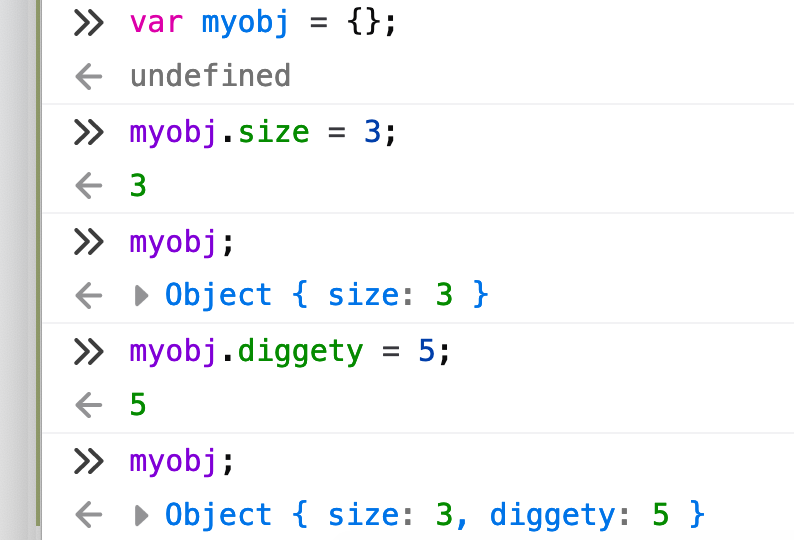

# Coronovirus Lets Learn To Code

## Introduction

This is a running curriculum of the class

## Purpose

To have a single point of information

## Scope

Each day I will publish what we are going to learn.

As we get through it we will collect useful website, links and resources and I will update this document with them.

## Things you will need

* the Zoom video conference client installed (https://zoom.us/download#client_4meeting)
* the Firefox web browser installed (https://www.mozilla.org/en-US/firefox/new/)
* the Atom editor installed (https://atom.io/)

## Overall Plan

The plan is to try and get through:

* what is a web page made of?
  * html (HyperText Markup Language - a way of creating structured elements in a webpage)
    * the `<head>` section
    * the `<body>` section
    * basic elements
      * `<div>`
      * `<span>`
      * `<h1>` etc
      * simple form elements
         * no forms posting to a webserver - just input for javascript
  * css (Cascading Style Sheets - a way of making HTML look pretty)
      * basics of CSS
      * selectors/intro to specifity
      * ***advanced*** using a CSS framework (probably Semantic UI)
  * js (Javascript - a programming language)
      * functions
      * scope
        * (and its discontents)
      * the DOM (Domain Object Model - how we make things happen on a webpage in a browser)
        * (and its discontents)
        * ***advanced*** using a JS framework (deffo JQuery)
* building something - an in-page calculator
  * make it look like a calculator
  * collect inputs
  * write a programming language in Javascript to calculate the result
* ***if we have the time***
  * write some music using Sonic Pi (http://sonic-pi.net/)

## Day 1 - Lesson

* getting to know our tools
    * Atom editor
    * Firefox Web Developer Tools
* writing our first web webpage with HTML
    * basic elements
* make our first webpage less ugly with CSS
    * inline styles
* mucking our webpage about with JS
    * from the web console

## Day 1 - Lesson notes

### Day 1a - Small Web Page

Lets build the smallest web page that works. Traditionally in programming this is called `hello world` make your language display the words Hello word.

This is it in `html`

```html
<html>
  <head>
  </head>
  <body>
    hello world
  </body>
</html>
```

This is actually not true - you can make smaller webpages.

### Day 1b - Proper Web Page

```html
<!doctype html>
<html lang="en">
  <head>
    <meta charset="utf-8">
    <title>Learning Coding In Lockdown</title>
    <meta name="description" content="My first webpage">
    <meta name="author" content="Gordon">
  </head>
  <body>
    <div>Hello World</div>
  </body>
</html>
```

### Day 1c - Basic Tags

`html` pages are made from tags - which come in two sorts.

* enclosing tags
     * `<div>Hello world</div>`
         * there is an opening tag `<div>`
         * and then a matching closing tag `</div>`
         * these are just like `(` brackets `)` in written English
* self-closing tags
    * `<hr />`

Here are some basic enclosing tags:

* `<h1>`, `<h2>`, `<h3>`, `<h4>`, `<h5>`, `<h6>`
* `<p>`
* `<div>`
* `<span>`

(Remember each opening tag `<div>` needs a closing tag after what it encloses `</div>`)

Here are some basic self-closing tags:

* `<br />`
* `<hr />`

### Day 1d - Nested Tags

Not all tags are stand alone. You need to nest tags inside tags sometimes.

An example is the bullet list and the numbered list

```HTML
<ul>
  <li>hello</li>
  <li>world</li>
</ul>
```

```HTML
<ol>
  <li>hello</li>
  <li>world</li>
</ol>
```

### Day 1e - Exercise 1

Write a short CV, header, paragraph or list, another header, another para or list.

Enclose all you content (words) in tags plz.

### Day 1f - Basic (Inline) Styling with CSS (Cascasding Style Sheet)

There are three ways you can do CSS:

* inline
     * write styles inside tags
* internal
     * write styles in the web page
* external
     * write styles in an external file and include that file into the webpage

  An inline style is just written into the tag:

  * `<p style="color:red;">This is a paragraph.</p>`

Here are some basic styles:

* `style="background-color:DodgerBlue;`
* `style="color:MediumSeaGreen;`
* `style="border: 2px solid Tomato;"`
* `style="border: 2px solid red;"`
* `style="border-radius: 5px;"`
* `style="font-family:"Courier New", Lucida Console, monospace;"`
* `style="font-style:italic;"`

Styles can be combined in a tag:

* `<p style="background-color:gray;color:orange;">This is a paragraph.</p>`

This was the original way of styling elements in html. Its not really scalable, and it technically isn't **Cascading Style Sheets** its just styles.

`CSS` was invented to solve the problem of millions of elements each with dozens of styles - and each bullet point needing to have the same styles applied. Nobody uses `inline` styles (except when they do).

### Day 1g - Mucking about


If we open the `console` in `webtools` in Firefox we can now muck about with stuff.

## Day 1 - Homework

* investigate other webtools
    * Chrome
    * Safari
* investigate other `html` tags and HTML5
    * image
    * links
    * buttons
    * inputs
* investigate other CSS selector operators like
    * `>`
    * `+`
    * `~`
    * `[target]`
    * `[attribute=value]`

## Day 2 - Lesson notes

We will carry on with the CV that we built last lesson.

If you have deleted it just copy this one rather than muck about rewriting it.

```HTML
<!doctype html>
<html lang="en">
  <head>
    <meta charset="utf-8">
    <title>Learning Coding In Lockdown</title>
    <meta name="description" content="My first webpage">
    <meta name="author" content="Alice">
  </head>
  <body>
    <h1 style="background-color:gray;color:orange;">Alice Asymptomatika</h1>
    <p>I working in marketing, but am taking the opportunity to learn coding online</p>
    <hr/>
    I would like to learn:
    <ul>
      <li>
        <p>
          HTML <small>(Hypertext Markup Language)</small>
        </p>
      </li>
      <li>
        <p>
          CSS <small>(Cascading Style Sheets)</small>
        </p>
      </li>
      <li>
        <p>
          JS <small>(Javascript)</small>
        </p>
      </li>
    </ul>
    <hr/>
    I would like to learn how to:
    <ol>
      <li>
        <p>
          Design website
        </p>
      </li>
      <li>
        <p>
          Build an app for the phone
        </p>
      </li>
      <li>
        <p>
          Work in tech
        </p>
      </li>
    </ol>

  </body>
</html>
```

### Day 2a - Better (Internal) Styling with CSS (Cascading Style Sheet)

  Here is an internal style. The style rules are the same as in inline styling. The difference is that each style is now preceded with a `selector`.

```HTML
  <style>
  body {
    background-color: linen;
  }
  p {
    color: maroon;
    margin-left: 40px;
  }
  </style>
```

The format is:

* `selector`
* opening curly brackets `{`
* styles which are:
    *  `style type`
    * `:`
    * `style details`
* and closed  by a closing curly bracket `}`

It is enclosed in a style tag and (conventionally) is included in the `<head>` section.

```HTML
<!doctype html>
<html lang="en">
  <head>
    <meta charset="utf-8">
    <title>Learning Coding In Lockdown</title>
    <meta name="description" content="My first webpage">
    <meta name="author" content="Alice">
  </head>
  <body>
    <h1 style="background-color:gray;color:orange;">Alice Asymptomatika</h1>
    <p>I working in marketing, but am taking the opportunity to learn coding online</p>
    <hr/>
    I would like to learn:
    <ul>
      <li>
        <p>
          HTML <small>(Hypertext Markup Language)</small>
        </p>
      </li>
      <li>
        <p>
          CSS <small>(Cascading Style Sheets)</small>
        </p>
      </li>
      <li>
        <p>
          JS <small>(Javascript)</small>
        </p>
      </li>
    </ul>
    <hr/>
    I would like to learn how to:
    <ol>
      <li>
        <p>
          Design website
        </p>
      </li>
      <li>
        <p>
          Build an app for the phone
        </p>
      </li>
      <li>
        <p>
          Work in tech
        </p>
      </li>
    </ol>

  </body>
</html>

  <!doctype html>
  <html lang="en">
    <head>
      <meta charset="utf-8">
      <title>Learning Coding In Lockdown</title>
      <meta name="description" content="My first webpage">
      <meta name="author" content="Gordon">
      <style>
      body {
        background-color: linen;
      }
      p {
        color: maroon;
        margin-left: 40px;
      }
      </style>
    </head>
    <body>
      <div>Hello World</div>
      <hr />
      <ul>
        <li<p>hello</p></li>
        <li><p>world</p></li>
      </ul>
      <ol>
        <li<p>hello</p></li>
        <li><p>world</p></li>
      </ol>
    </body>
  </html>
```

These styles (with a single selector) apply to all tags of a type - all your paragraphs have the same font size. Lets fix that with some cascading style sheets.

### Day 2b - Cascading Styles

Lets get some text and some bullet points and then style part it.

```HTML
<h1>Gordon Guthrie</h1>
<p>I am a strong technologist with experience of:</p>
<ul>
  <li>
    <p>Erlang</p>
  </li>
  <li>
    <p>Elixir</p>
  </li>
  <li>
    <p>LFE</p>
  </li>
</ul>
```

If we now add the style:

```HTML
<style>
  li p {
    font-style:italic;
  }
</style>
```

This selector `li p` says apply this style to all tags `<p>` inside a pair of `<li>` tags

The style has **cascaded**.

If we edit the style to say:

```HTML
<style>
  h1, li p {
    font-style:italic;
  }
</style>
```

This style now applies to the header as well as the bullet points.

The comma `,` is an operator - its technically a boolean `OR` so the selector `h1, li p` means *if the tag is* `<h1>` *OR the tag is a* `<p>` *inside an* `<li>`.

### Day 2c - Exercise

Add some inline styling to our CV using cascading selectors

### Note: Day 2 was cut short by Zoom chopping us off at 40 minutes free lesson and then locking us out

## Day 3 Lessons

### Day 3a - External CSS files

To make it easy to tech and show we are putting our CSS directly into our webpages using the `<style>` tags but this gets cumbersome.

Normally you write your `css` in a different file and then include it into the page.

Our webpage looks a bit ugly and not very distinctive so lets jazz it up with some proper fonts.

At the moment the fonts used to display the webpage are the normal ones that come with the computer but they look a bit shite.

Google hosts a lot of fonts at https://fonts.google.com/ let add them.

We do that by adding this line to the `<head>` of our webpage.

```html
<link rel="stylesheet" href="https://fonts.googleapis.com/css?family=Lobster">
```
This will pull in a special `css` file that makes a webfont available. Webfont `css` is a right monkey business to do yourself so it is best at the moment to just let Google sort it out for us.

We now need to make our webpage use that new font by adding it to the

```html
<style>
      body {
        font-family: 'Lobster', serif;
        font-size: 48px;
      }
    </style>
```

### Day 3b - Exercise

Find two fonts you like that go together on Google.

One for the headline, one for the bodytext.

Use a style sheet to apply them.

### Day 3c - Introduction To REPLs

We are going to start today by writing javascript in the browser console.

The console is an example of a REPL (a Read-Evaluate-Print-Loop).

Lots of `interpreted` languages have REPLs.

Here is a website with online REPLs:

https://repl.it/languages

### Day 3d - Javascript and its discontents

Javascript is a standard language - all web browsers run the same Javascript. That sounds good, but...

Javascript the language interacts with the Browser by call functions that have been exposed on the DOM (Domain Object Model).

A ***Domain*** is a functional area, it might be banking, it might be health checks, it might be anything, but here is ***a browser***.

***Object*** is a term of art - it refers to a programming style where you have a ***thing*** (the object) and it exposes ***functions*** which you call against it. The ***object*** hides its internals from you. Think of it as a control panel with a load of switches and dials. You don't get to see the internal electrics, all you do is toggle the switches and read the dials.

***Model*** is just that a model - we have build an ***object*** set of ***functions*** that model what the browser does and allows you to manipulate all the things we have looked at: `tags` and `styles`.

The problem is that each browser has its own `DOM`. They are **mostly** the same but sometimes the functions have slightly different names, and more often the functions have slightly different behaviours.

Think of it like cash machines. Each cash machine exposes the same functionality (`get cash`, `get balance`), each does it with similar buttons (`numbers`, `help`, `clear`, `submit`) but the buttons are in different places, the amount of money to get out varies. Each `DOM` is like that - it is a cashmachine, just not exactly the same cash machine.

We are going to start by writing a bit of raw `javascript` against the `DOM`. This is the ***first*** and ***last*** time you will ever do this.

If you write `javascript` against the `DOM` then you have to test every time `if this is running in Chrome do this, if it is in Safari do that, if it is in Edge do something else`. This is tremendously tedious.

People ***always*** write `javascript` against libraries and frameworks that **abstract the DOM** and offer a consistent interface.

Later on we will do that with `jquery`. `jquery` is considered a bit old-fashioned now, the cool kids are off on new frameworks like `jsx`, or `angular` or `react` or `ember` or `node`. But the cool kids are always off on something new in `javascript` land.

`javascript` was written in a week to meet a sales deadline. It has a lot of problems - global state. 20 years later a lot of the things you see (frameworks, transpiled languages targetting `javascript`, tool pipelines) are new attempts to fix things laid down in a hurry in that first week.

### Day 3e - Javascript in the console

Lets crack open our web console. Click the `hamburger` menu top left in Firefox to get the options menu and select `Web Developer`:


Then from the second menu select `Web  Console`:


This gives us the webpage with the console open at the bottom:


We will be using only the basic menu items:

* Inspector
* Console


***Lets Code!***

Select the `console` menu item and type this into the console.

```Javascript
var mydiv = document.querySelector("h1");
```

When you press return this will print `undefined`.

So what is this? What does it mean.

`document` is an object. You remember the ***Domain Object Model*** - well that object. And `document` is the name of the webpage you can see in your browser.

`querySelector()` is a function on the **object*** that does something (a switch or a dial). It performs a ***query*** using a selector. That ***selector*** as it happens has the same form as a `css` selector. So here we use `h1` but we could use any of the other `css` selectors we have played with.

We pass that function a set of parameters - in this case the set only has 1 member and it is a ***string*** which describes the selector. The string is `"h1"` and the list of parameters is delimited by `(` and `)`. This enclosing pattern is the same pattern we saw with `html` tags and with `{` and `}` in `css`. It is a fundamental convention of software, languages have a way to mark ***start*** and ***end***, ***alpha*** and ***omega***.

That function returns a value - that value is an ***object***.

The equals operator `=` assigns that value on the right hand side to the left hand side (Arabic numerals, code works right-to-left not left-to-right, even though the actual words are written left-to-right, lololol).

It assigns the `object` to the variable `mydiv`. `mydiv` is a name (`alice`, `bob`, `charlie`) that I, the developer will use to keep track of things. All languages have variables, in most languages they can even vary (not the mighty `Erlang` tho, there variables don't vary, and that's why we luv it).

We know `mydiv` is a variable because we have declared it to be with the `var` ***keyword*** (shortened from variable).

Each programming language has its set of ***keywords*** that you have to learn. Usually there are about 30 to 50. Keywords are often shared across languages. (See the Day 2 Appendix).

Finally the `=` is a ***operator*** - it takes whatever is on the right hand sign and assigns to whatever is on the left hand side. It doesn't return a result (some javascript ***functions*** do something and don't return a value, some do something and return a value, most ***operators*** don't return a value (they are implemented as ***functions*** under the hood)).

So the REPL prints the result of the last operation - and that result is `undefined` - no value returned.

The last thing we haven't talked about is `;` which means ***line ending*** in javascript - it is a ***delimiter***. Again delimiters are shared across programming languages.

Lets look at another function.

```Javascript
console.log("bob");
```

Press return and we get `bob`.

Lets break this down again. The ***function*** is called `log` it is taking `"bob"` as a ***parameter*** and the ***function*** is attached to an ***object*** called `console`. The main webpage is an ***object*** called `document` and it turns out the `console` is a webpage ***object*** called `console`.

`log` takes the ***parameter*** it is given and tries to turn it into something readable then print it out in the `console`.

The parameter can be an ***expression*** that evaluates to a single term:

```Javascript
console.log(3+2);
console.log("fish" + "bicycle");
console.log("fish" + 2);
```

Lets use this ***function*** to inspect our variable `mydiv`.

```javascript
console.log(mydiv);
```

We get a big output:


Eek!

If we scroll down we see that there is a thing called `innerText`. This is the text that appears inside the `h1` tag. We can now use `javascript` to rewrite that:

```Javascript
mydiv.innerHTML = "banjo";
```

And it changes on the page.

***Well done, you have done your first bit of  coding!***

### Day 3f - Exercise

Inspect the `h1` object. Select another object (eg `p`) and inspect that too. How similar and how different are they?

Print the `console` object with `console.log` and inspect that. How is it different to a text object like an `h1` or a `p`?

Can you ***clear*** the console?

### Day 3g - JQuery in the console

Because we said earlier that nobody manipulates the `DOM` raw but uses a wrapper library, lets do that now.

Lets install the `jquery` library code as an ***external*** `javascript` file.

in the `<head>` section lets add the line:

```HTML
<script src="https://ajax.googleapis.com/ajax/libs/jquery/3.4.1/jquery.min.js"></script>
```

This is just a `<script>` tag but instead of containing `javascript` it has a URL that says ***go to this web address and get a script from there and stuff it into the webpage here***.

***Eek*** its time to talk about ***scope***. Scope is a messy thing - it is the context in which a thing exists. At the top level is what is called ***global*** scope.

In a browser only one thing exists by default - the `document` object - the `DOM`. When we open the debugging tools, the console, it adds another thing - the `console` object.

If we type in the console `x=3` we implicitly create an object called `x` in the global scope.

(This is not good, it is ***global pollution*** and it comes from `javascript` being a one week rush job.)

`jquery` introduces another global object which has the name `$`.

Lets look at what `$` contains by popping it into `console.log()`


`jquery` is just another `javascript` `object{}` - like `document` and `console`. We are going to write `javascript` `object{}`s just like it.

`jquery` works by first selecting objects using `css` selectors and then calling functions that act on the selection.

In the console type `$("p");`

This selects all the `<p>` tags and returns an `array` of them.


An `array` is just a datastructure. You can think of it as a doocot (pigeonholes for readers furth of Scotland). A set of slots numbered 0, 1, 2, 3 into which you can put things, like letters in a pigeonhole.

Note that it counts from ***zero*** and not ***one***. There is an actual reason early programming languages did that (pointer arithmetic) and there is the arsehole's smug pseudo-reason (real mathematicians count from zero). Tech is full of arseholes and identifying and ignoring them is a key skill. This question (and how people respond to a noob asking it) is a good way of doing that.

Now we can use `jquery` to manipulate our `html`

If we do `$("p")[0].innerText = "bingo";` in the console we should see the first paragraph change.

`array`s can be iterated over with a function - ***for every slot in the doocot do something to whatever is in the slot***. We will learn how to do that later.

### Day 3h - Writing inline javascript

Remember our principle ***ABW*** lets start with a simple working webpage with some inline Javascript

```HTML
<!doctype html>
<html lang="en">
  <head>
    <meta charset="utf-8">
    <title>Learning Coding In Lockdown</title>
    <meta name="description" content="My first webpage">
    <meta name="author" content="Alice">
    <style>
    input[type=button] {
      border-radius: 7px;
      margin: 10px;
      padding: 10px;
      background-color: #2b88ff;
      color: white;
    }
    </style>
    <script src="https://ajax.googleapis.com/ajax/libs/jquery/3.4.1/jquery.min.js"></script>
  </head>
  <body>

    // what we are going to display
    <input type=button value="Click Me">

    // our javascript
    <script>
      alert("hello");
    </script>

  </body>
</html>
```

Lets have a look at the `html` of this webpage.

In the `<head>` we have some styles for an input button inside a `<style>` tag and the our `jquery` `<script>` tag.

In the body we have first a single button, then some `javascript` inside a `<script>` tag.

When we open the webpage we see a pop up box saying "hello". The `alert()` function does that.

So the web page loads, all the javascript in the `<script>` tags runs.


### Day 3 Homework

Go to https://repl.it/languages and look at the different languages and examples.

Play about with the console and look at the other menus.

Try and find the console in other browsers like Chrome or Safari.

Read the Day 2 Appendix on Javascript Keywords

### Day 3 - Appendix Javascript Keywords

These are the most common javascript keywords:

* boolean
* break
* case
* catch
* char
* const
* do
* double
* else
* false
* float
* for
* function
* if
* in
* instanceof
* int
* new
* null
* return
* true
* try
* typeof
* var
* while

***Don't Panic!*** there is a trick to recognising them. When you write code you typically make up names for things in three styles:

* functions have ***verby*** names `do_something()` like `querySelector()`
* variables have ***nouny*** names: `house`, `car` like `mydiv`
* booleans have ***questiony*** names: `is_condition?` like `is_valid?`, `is_visible?`

Most keywords are ***little words*** (`else`, `while`), ***adjectives*** (`constant`), ***abstract nouns*** (`true`, `false`) or ***blankish verbs*** (`try`, `do`).

Basically if its bland its probably a language keyword, if its vivid its not.

For reference here are the rest:

* abstract
* arguments
* await
* byte
* class
* continue
* debugger
* default
* delete
* enum
* eval
* export
* extends
* final
* finally
* goto
* implements
* import
* interface
* let
* long
* native
* package
* private
* protected
* public
* short
* static
* super
* switch
* synchronized
* this
* throw
* throws
* transient
* void
* volatile
* with
* yield

## Day 4 Lesson

The next few lessons are about building a calculator.

The final result will look something like this:


We will start by building an ***ugly***, ***broken*** calculator.

The next session will be an online lab session, in which you will make it a ***pretty***, ***broken*** calculator.

After that we will learn how to write ***basic*** programming language to make the calculator work. From that you will add error handling and brackets in another online lab.

### Day 4a More `html` - class/id/data- and their `css` selectors

We have seen basic `html` tags like `<p>`, `<h1>`.

These tags on their own are slightly limited. Doing things to ***all paragraphs*** or ***all headers*** is no longer good enough.

We can decorate individual tags with properties and use those. The most important property is a `class`

```html
<!doctype html>
<html lang="en">
  <head>
    <meta charset="utf-8">
    <title>Learning Coding In Lockdown</title>
    <meta name="description" content="My first webpage">
    <meta name="author" content="Alice">
    <script src="https://ajax.googleapis.com/ajax/libs/jquery/3.4.1/jquery.min.js"></script>
    <style>
      .button {
        width: 70px;
        text-align: center;
        border-style: solid;
        padding: 8px;
        margin:  8px;
      }
    </style>
  </head>
  <body>
    <div>Calculator</div>
    <div class="button">Zero</div>
    <div class="button">One</div>
  </body>
</html>
```

We can now target the `<div>`s we want with our style - only style `<div>`s that have the `class` ***button*** as buttons.

The second important attribute is a user-define data item. These take the form `data-` followed by a `user defined name`:

```html
<div class="button" data-buttonvalue="0">Zero</div>
<div class="button" data-buttonvalue="1">One</div>
```

The third attribute (which is less used these days) is `id`. The standard says there should on be one `id` of a given name on a page - and most functions that work on `id` will only return one - so if you muck up and add two things can do wrong. Oftentimes we just use `class` and only have one element with that `class name` on a particular page.

Each of these special tags have their own `css` selectors - and these selectors are reused by `jquery`.

Here they are paired up.

The `class` selector is the `class name` with a `.` before it

```
.button {
  width: 70px;
}
<div class="button">Zero</div>
```

`data-` is the full data name inside `[` and `]`

```
[data-buttonvalue] {
  ...
}
<div class="button" data-buttonvalue="1">One</div>
```

But you can also select specifically on the value of the `data-` item and other stuff other selectors:

```
[data-value="foo"] {
  /* Attribute has this exact value */
}

[data-value*="foo"] {
  /* Attribute value contains this value somewhere in it */
}

[data-value~="foo"] {
  /* Attribute has this value in a space-separated list somewhere */
}

[data-value^="foo"] {
  /* Attribute value starts with this */
}

[data-value|="foo"] {
  /* Attribute value starts with this in a dash-separated list */
}

[data-value$="foo"] {
  /* Attribute value ends with this */
}
```

The `id` selector is the `id name` with a `#` before it

```
#equalsbutton {
  width: 70px;
}
<div id="equalsbutton">=</div>
```

An individual tag is represented by the box model:


If you look at the `css` you will see that I have set some of these values. You will need to explore and figure out what ones you want to use to make your calculator look purty.

### Day 4b More `html` - rows/columns

We can use `<row>` and `<column>` tags to structure our layout. This is the `html`:

```HTML
<!doctype html>
<html lang="en">
  <head>
    <meta charset="utf-8">
    <title>Learning Coding In Lockdown</title>
    <meta name="description" content="My first webpage">
    <meta name="author" content="Alice">
    <script src="https://ajax.googleapis.com/ajax/libs/jquery/3.4.1/jquery.min.js"></script>
    <style>
      .button {
        width: 70px;
        text-align: center;
        border-style: solid;
        padding: 8px;
        margin:  8px;
      }
      column {
        float: left;
      }
      .clear {
        clear: left;
      }
    </style>
  </head>
  <body>
  <row>
    <column>
      <div class="button number">0</div>
    </column>
    <column>
      <div class="button number">1</div>
    </column>
    </row>
    <div class="clear"><div>
  </body>
</html>
```

`<row>` and `<column>` don't in themselves layout tables for you - they indicate to the reader that this will be done in rows and columns - but you have to do the positioning yourself. ***Positioning is hard*** and there is no way to teach you it in this short course (mostly because I don't understand it properly myself lololol).

We will use the `float` and `clear`. As you have seen normal `html` just runs up and down the page. Each item on a line - nothing side by side. `float` as a style lifts the element out of this running order and lets its float either `left` or `right`. Typically after you have floated something you need to put things back on track. That's done with a `clear`.

This is another example of `delimiting` - starting, some thing in the middle, ending. In this case is it `float: left;` to start floating left followed by `clear: left;` to finish.

There are some other important `css` stuff to do with the `display` property - which again is too big a subject to cover in detail. But we can look at one super-useful style that you will need `display: none;` This makes elements invisible and we will look at it later.


### Day 4c More `css` - pseudo-styles

To make our things human-good - we need more that static styles, this is where `pseudo` selectors come in. The `pseudo` styles are transient styles. Here are two common ones:

* `.button:hover` is a style that applies when the mouse is over an element with the `classname` `button`.
* `.button:active` is a style that applies when an element with the `classname` `button` has been `clicked` but not `released`

The `pseudo styles` are appended to the selector with a colon, so this selector breaks down as:

* `button` - a class named `button`
* `:` - use a pseudo style
* `active` - the pseudo style to use

Obviously the first selector can be anything a tag like `p`, a list of selectors like `p, .button` some descending ones line `ol li` etc, etc

```html
    <!doctype html>
    <html lang="en">
      <head>
        <meta charset="utf-8">
        <title>Learning Coding In Lockdown</title>
        <meta name="description" content="My first webpage">
        <meta name="author" content="Alice">
        <script src="https://ajax.googleapis.com/ajax/libs/jquery/3.4.1/jquery.min.js"></script>
        <style>
          .button {
            width: 70px;
            text-align: center;
            border-style: solid;
            padding: 8px;
            margin:  8px;
          }
          .button:hover
          {
            box-shadow: 5px 5px 2px 0px rgba(0,0,0,0.25);
          }
          .button:active
          {
            background-color: #dddddd;
          }
        </style>
      </head>
      <body>
            <div class="button number">0</div>
            <div class="button number">1</div>
            <div class="button number">2</div>
            <div class="button number">3</div>
            <div class="button number">4</div>
          </div>
      </body>
    </html>
```

To get kooler colours use the Adobe Color Wheel:
https://color.adobe.com/create

### Day 4d More `js` - `jquery` functions, `click`, `text`, `addClass`, `removeClass`

To build our calculator we are going to use some basic `jquery` commands.

We will apply functions to buttons using the `click` command. We pass this command a function (as a callback) and when the button is clicked the function runs.

That function will set some text using the `text` command and also add and remove classes with `addClass` and `removeClass`.

By creating a style that uses `display: none;` we can then hide and show things.

Here is the `html`:

```html
<!doctype html>
<html lang="en">
  <head>
    <meta charset="utf-8">
    <title>Learning Coding In Lockdown</title>
    <meta name="description" content="My first webpage">
    <meta name="author" content="Alice">
    <script src="https://ajax.googleapis.com/ajax/libs/jquery/3.4.1/jquery.min.js"></script>
    <style>
      .button {
        border-style: solid;
      }
      column {
        float: left;
      }
      .clear {
        clear: both;
      }
      .hide {
        display: none;
      }
      #proud, .button {
        width:      80px;
        text-align: center;
        padding:    8px;
        margin:     8px;
      }
    </style>
  </head>
  <body>
  <row>
    <column>
      <div class="button number hideable">Zero</div>
    </column>
    <column>
      <div class="button number hideable">One</div>
    </column>
    </row>
    <div class="clear"><div>
    <row>
      <column>
        <div class="button hidebutton">Hide</div>
      </column>
      <column>
        <div class="button showbutton">Show</div>
      </column>
      </row>
      <div class="clear" id="proud"></div>
      <script>
      var hidefn = function () {
        console.log("hide clicked");
        $(".hideable").addClass("hide");
        $("#proud").text("I hided it!")
      };

      var showfn = function () {
        console.log("show clicked");
        $(".hideable").removeClass("hide");
        $("#proud").text("I shown it!")
      };

      $(".hidebutton").click(hidefn);
      $(".showbutton").click(showfn);
      </script>
  </body>
</html>
```
### Day 4e - Exercise

Build the ***ugly broken calculator***.


When you click the buttons the formula should update. The buttons should behave like buttons (ie change when the mouse is over them and they are clicked).

Don't worry about the layout for now.

To get the formula to build you will need to create a variable something like this:

```javascript
var formula;`
```

And then in the clicks do soemthing like this:

```javascript
formula += buttonclicked;
```

where you have gotten the value `buttonclicked` with the `jquery` `data` function.

Don't try and make it too pretty, and don't try and lay it out yet.

Here is a starter:

```HTML
    <!doctype html>
    <html lang="en">
      <head>
        <meta charset="utf-8">
        <title>Learning Coding In Lockdown</title>
        <meta name="description" content="My first webpage">
        <meta name="author" content="Alice">
        <script src="https://ajax.googleapis.com/ajax/libs/jquery/3.4.1/jquery.min.js"></script>
        <style>
          .button {
            width: 70px;
            text-align: center;
            border-style: solid;
            padding: 8px;
            margin:  8px;
          }
          .number {
            border-color: darkred;
            color: darkred;
          }
          .operator {
            border-color: darkblue;
            color: darkblue;
          }
          .display {
            border-style: solid;
            border-width: thin;
            border-color: lightgrey;
            width: 70px;
            padding: 8px;
            display: block;
          }
        </style>
      </head>
      <body>
        <div>
            <h2>Formula</h2>
            <div class="display" id="formula"></div>
          </div>
          <div>
            <div class="button number">Zero</div>
          </div>

          <div>
            <div class="button operator">Plus</div>

          </div>

          <script>
            var formula = ""

            var buttonclickfn = function (e) {
              console.log("button clicked");
            }

            $(".number, .operator").click(buttonclickfn);
          </script>
      </body>
    </html>
```

## Day 4 Homework

* read up on `jquery` and the functions it offers (we are using 3.4.1)
* look into `css` selectors again

## Day 5 - Lab Exercise

Make your calculator purty. Don't make it ***identical*** to this, just make it a lot prettier than a list of buttons. Use fonts, colours, pseudo-selectors, rounding, thickness, padding, margin, whatevs makes it yours ;-)



## Day 6 - Introduction To javascript

### Day 6a - Types

In the console type:

```javascript
var int = 1;
var float = 2.0;
var boolean = true;
var string = "abcdefg"

var object = {};
var array =["a", 2, true];

var number = int + float;
print(number);
```

`numbers` have various operators that they can use - the normal numeric ones:

* `+` for adding
* `-` for subtracting
* `*` for multiplying
* `/` for dividing (does floating point division)

but also some less familiar ones:

* `**` for `exponential`s `2**4` is ***2 to the power 4*** ie ***2 times 2 times 2 times 2***
* '%' is the `remainder` for integer division `9 % 2` gives ***2 goes into 9 4 times, remainder 1 - return 1***

ha-ha, I thought the carat operator `^` was the `exponent` becuz other programming languages, turns out its the `bitwise XOR` operator - check all the things kidz.

There are also a some of compound operators:

* '++'
* '--'
* '+='
* '-='

The double operators are `increment` and `decrement` and are used like this:

```javascript
var n = 99;
n++;
```

`+=` and `-=` are syntactic sugar - they mean you have to type less. Consider the following statement:

```javascript
var html = "<tag>";
html = html + "some content";
html = html + "</tag>";
```

This can be rewritten using `+=` to get rid of the second ***html*** on each line:

```javascript
var html = "<tag>";
html += "some content";
html += "</tag>";
```

so `+=` just means ***add this to me***.


There are 6 types:

* `string`
* `number`
* `undefined`
* `null`
* `boolean`
* `symbol`

`object` and `array` are data structures.

`strings` types have various built in functions. Lets look at one we will need later to build our calculator.

```javascript
var mysentence = "now is the time for all good men to come to the aid of the party";
var wordsarray = mysentence.split(" ");
```

`.split()` chops up a `string` into an `array` of `string`s using the `string` you pass in to guide the knife. So by passing a space `" "` we turn a sentence into an array of words.

### Day 6a - Type Exercises

1. what happens when you add a `string` to a `number`? `1 + "a"`
2. what happens when you take a `string` away from a `number`?
3. what happens if you add a `boolean` to a `number`?
4. what happens if you add a `boolean` to a `string`?
5. what happens if you add a `number` to an `object`?
6. what happens if you use the `decrement` operator `--` on a number?
7. some other `string` functions are `.concat()`, `.includes()` - can you find other `string` functions using Google. What do they do?
8. what happens if you split a `string` with an empty string `""` in the `.split()` function?

### Day 6b - Functions

`functions` are core building blocks of `javascript`.

A `function` is defined as so:

```javascript
var myfun = function (x, y, z) {
  console.log(x);
  console.log(y);
  console.log(z);
};
```

To invoke that function you would call it:

```javascript
myfun(1, "a", true);
```

A `function` may or may not have one or more `return` statements. If it doesn't have a `return` it returns the value `undefined` when invoked. When it hits a `return` statement it terminates (we will see more of this in the section on flow control).

Lets break that down. `myfun` is the name we have given the `function` it is just a normal `javascript` variable.

The phrase `function(...)` is the `function` declaration - it tells the run time to make a `function`. Inside the brackets is the argument list, separated by commas `x`, `y` and `z`. So when we call this function, in this case it expects 3 arguments.

Functions can have 0 to (depending on the browser) 65535, 262143, 131071 or 1048576 arguments, but frankly that's silly. If you have more than 5 you are probably doing it wrong.

Remember `function`s can be thought of as ***verbs*** so the argument list is the list of things you ***verb***. Image a function like:

```javascript
var add = function(a, b, c) {
  return a + b + c;
}
```

In this case it ***verbs*** (add) ***a*** and ***b*** and ***c*** - it does the verb on the arguments.

### Day 6b - Functions Exercise

1. create your own function. It has a `length` property, what do you think that means?
2. what happens if you call your function with too few or too many arguments?

### Day 6c - Arrays

An array is a set of values.

```
var myarray = [1, "b", true];
```

You see that an `array` isn't typed - it takes any sort of element - but normally you try and write ***homogenous*** `array`s. So an `array` that only contains `number`s or `string`s or `function`s or `object`s.

Some languages enforce homogenous `array`s but `javascript` doesn't. Mixing your `array`s is like mixing your drinks only the hangover is much, much worse, lololol.

`array` elements are like slots. You have a `length` property and a `.forEach()` function (among many others). `.forEach()` takes a `function` as a parameter and applies that function to each element in the `array`.

We can see what properties and functions an `array` has using the console.



You can pull elements out with an `index`. Beware this index starts a `0`.

The array syntax looks like this:

```javascript
// for properties
var len = myarray.length;
//for elements
var first_element = myarray[0];
var second_element = myarray[1];
```

The `forEach` function takes a function as an argument:

```javascript
var myfun = function (x) {console.log(x);}

myarray.forEach(myfun);
```

You can add elements to an array with `push`

```Javascript
myarray.push("blah");
```

### Day 6c - Array Exercises

1. create you own `array` and then `push` something. What happens?
2. `pop` has a sister function `pop`, what does it do?
3. what does the function `.toString()` do?
4. find some built in `function`s of `array`s using the `console` and then look them up on Google, what do they do?

### Day 6d - Objects

An `object` is just a container of values (and usually some of these values are functions).

```Javascript
var myobj = {};
```

You can put named elements into an object:
```Javascript
myobj.size = 3;
```

and then pull them out with the equivalent property.

We can see this in the console:



You can also put functions into `object`s:

```javascript
var myfun = function () {console.log("Howdy!");};
var myobj = {};
myobj.a_function = myfun;
```

### Day 6d - Objects Exercise

1. create an `object` and put a function into it, then invoke the function from the object name.
2. inspect the `object` in the `console`

### Day 6e - Flow Control 1 - `if` statements

We will be writing longer code fragments so from now on they will be contained in functions that can be invoked.

The most common flow control is the `if` statements which might be paired up with `else if` and `else`. Here's an example:

```html
<!doctype html>
  <html lang="en">
    <head>
      <meta charset="utf-8">
      <title>Learning Coding In Lockdown</title>
      <meta name="description" content="My first webpage">
      <meta name="author" content="Alice">
      <link rel="stylesheet" href="https://fonts.googleapis.com/css?family=Lobster">
    </head>
    <body><script>
  var run = function (a) {

    console.log(a);
    if (a > 0) {
      console.log("greater than zero");
    } else if (a === 0) {
      console.log("is zero");
    } else {
      console.log("less than 0");
    }
  };
</script>
</body>
</html>
```

Instead of printing the result we can `return` different values using the `return` keyword.

```javascript
<script>
  var run = function (a) {

    console.log(a);
    if (a > 0) {
      return "greater than zero";
    } else if (a === 0) {
      return "is zero";
    } else {
      return "less than 0";
    }
  };
</script>
```

Flow control with `if` is super-common, I can't think of a programming language that I have used that doesn't use them.

### Day 6e - Flow Control I Exercises

1. Write a function that takes a `string` as a parameter and checks if the `string` contains the letter `a` (in either upper or lower case). Use the built-in `string` functions `.includes()` and `.toLowerCase()` or `.toUpperCase()`.
1. Write a function that takes a `string` as a parameter and returns the rest of the `string` after the first occurrence of `a`. Find the string functions you need online.

### Day 6f - Flow Control II - the `switch` statement

The `switch` statement (known in other languages as `case`) is a basic flow control.

```javascript
<script>
  var run = function (a) {

    console.log(a);
    var type = typeof(a);
    switch (type) {
      case "string":
        console.log("its a string");
        break;
      case "number":
        console.log("its a number");
        break;
      default:
        console.log("its something else: " + type);
      };
      console.log("I'm done here");
  };
</script>
```

lets break it down. `switch` is the keyword and it chooses a branch to execute based on the value it is passed `(type)`. It is inside brackets because it needs to be evaluated, it could be `(1+3)` or `(a/b)` or `(typeof(a))`

It then opens a pair of curly brackets `{` and `}` which define the body of the `switch` statement.

That statement has two defined `case`s and a `default` `case` for anything. It drops through the `case` statement looking for a match.

So if we call `run(3)` what happens?

* the value of `type` is `number`
* so it hits the first case and says ***is type equal to "string"?***, ***nope, lets continue***.
* then it drops to the 2nd case and goes ***is type equal to "number"?**, ***well why, yes it is, lets do this*** so:
    * it then runs `console.log("its a number");`
    * and then hits `break` and goes ***ok I am done here***
    * and it jumps to the final `}` and continues
* now it hits `console.log("I'm done here");` and prints that

The `break` statement is important - if you miss it it carries ob dropping through

You can replace `break` with `return` and the function will just `return` from inside the `switch` statement. (if you do that the line `console.log("I'm done here");` won't run tho.


### Day 6f - Flow Control II Exercises

1. play about with the example, add other cases for `objects` and `functions`
2. play about with the example - take a `break` out, what happens?
3. play about the example replace `break`s with `return`s what happens?

### Day 6g - Flow Control II - for loops

A for loop just does something repeatedly. This function starts with a sentence, breaks it down into an array or words and loops over the array printing each word.

```javascript
<script>
var run = function () {

  var sentence = "now is the winter of our discontent made glorious summer by this Son of York"
  var wordarray = sentence.split(" ");
  var no_of_words = wordarray.length;
  var i = 0;

  console.log(wordarray);
  console.log("there are " + no_of_words + " words");
  console.log("i is set to: " + i);

  for (i; i < no_of_words; i++) {
    console.log("word " + i + " is " + wordarray[i]);
  };
};
</script>
```

Lets break it down. It starts with the keyword `for` which takes a three part expression `(i; i < no_of_words; i++)`.

* the *first* expression is ***where am I starting from?*** - here we are starting from `0` - the value of `i` is zero.
* the *second* expression is ***when do I stop?***. The loop will continue as long as this expression evalutates to `true`. In this case `no_of_words` is `15` so first time at the rodeo `i < no_of_words` is `0 < 15` which is `true` so lets loop.
* the *third* expression is the *what do I do afterwards?*** which in this case is `i++` which means ***bump i by 1***

Second time round the rodeo `i` is now `1` and `i < no_of_words` is `1 < 15` which is `true` so we go round the rodeo again, bumping `i`.

Eventually `i` hits 15 and we stop. Because 15 is the number of words in the `array` we stop before we get there becuz ***stupid*** counting from `0` in arrays ;-) suckeee, suckee, suckee.

You often see these loops written with the variable declared in the loop itself:

```javascript
for (var i; i < no_of_words; i++) {
  console.log("word " + i + " is " + wordarray[i]);
};
```

### Day 6f - Flow Control III Exercises

1. you can count a loop backwards
      * for the ***first*** element have `i` start as `no_of_words - 1`
      * for the ***second*** element test if `i` is negative
      * for the ***third*** element use the `decrement` operator `--`
2. `for` has a little chum called `while` that is not used as much. Look it up on the internet and try and write a `while` loop
